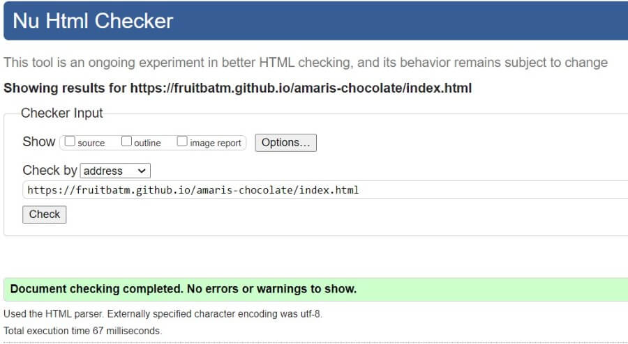
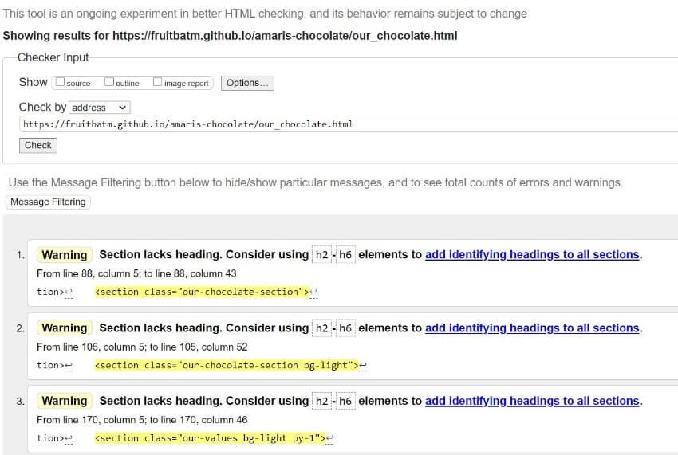
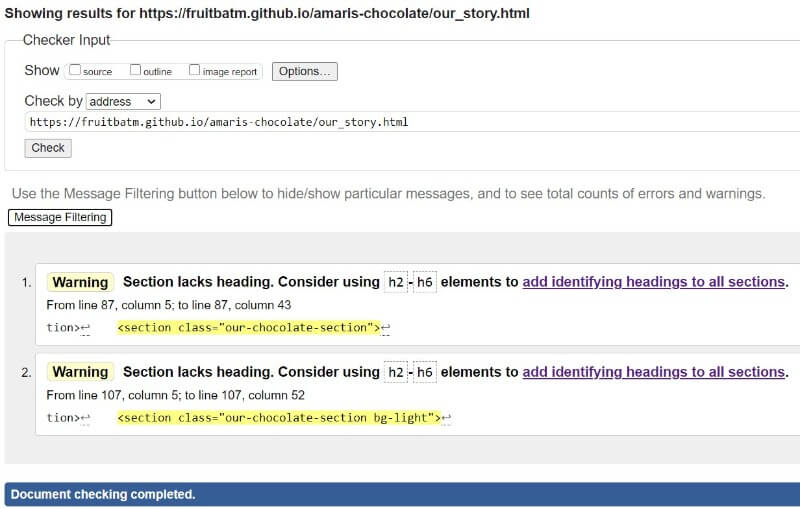
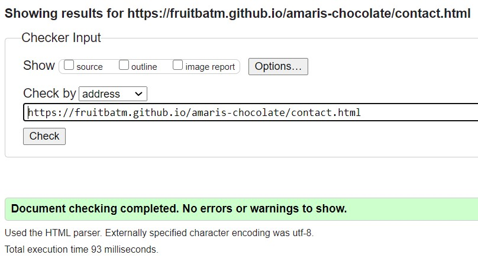
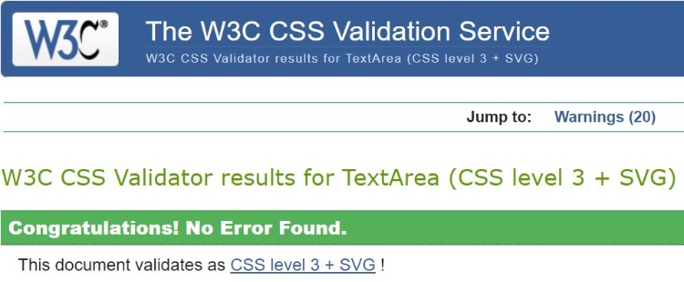
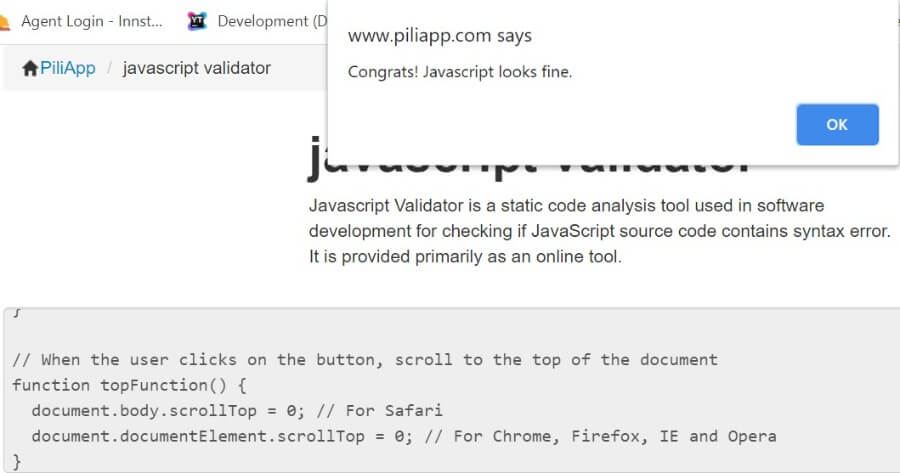

# Testing
## Table of Contents
1. [User Stories Testing](#user-stories)
2. [Code Validation](#code-validation)
3. [Functionality Testing](#functionality-testing)
4. Performance Testing
5. Encountered Issues

# User Stories Testing
## Visitor Stories
- **As a site visitor, I would like to learn more about the company and what products the company offers.**
    - The main goal of the website was to promote the company and its products. On the landing page, a visitor can immediately find a brief information about the brand and about chocolate bars they produce and offer.
    By clicking on "read more" button under "Our Chocolate" and "Our Story" sections, the user will be redirected to these pages where he/she will be able to find more information. Also, these pages are easily accessible
    from the top navigation bar. 

- **As a site visitor, I would like to easily navigate through the site and find what I'm looking for with an ease.**
    - From the fixed top navigation bar, a user can easily access all other pages.
    - Since the website has a responsive navigation bar, it collapses on small and medium devices to navbar-toggler-icon (hamburger menu) which gives the user an opportunity for easy access to all pages on mentioned devices.  
    - On the landing (home) page, under each section there is a button that directs the user to the respective pages.
    - Back to top arrow button appears on the lower right of page when the user start to scroll down a page. Once clicked, it jumps to the top or the webpage.
    - Clicking on the company logo located on top left of each page, the user is taken to the home page.

- **As a site visitor, I would like to contact the company if I might have any enquires.**
    - In the footer section, the company's contact details (email and telephone number) are visible to a site visitor. 
        - Email address is linked to 'mailto:' link that allows users to send an email to stated email directly from the page.
        - Telephone number is linked to 'tel:' link. This tells the browsers to use the number and once clicked by the user, the pop-up dialing box will appear ready for the user to click the call button.
    - On the fixed top navigation bar there is a link to "Contact Us" page where a site visitor can fill and submit a contact form.
    - The site visitor also has an option to contact the company via social media links located at the bottom footer on all webpages.

- **As a site visitor, I would like to have an option to order the products the company offers.**
    - The "click to order button" is located on the landing page, just below the chocolate bar selection. Also, the button is located on 'Our Chocolate' webpage.
    Once the button is clicked, the visitor will be directed to contact form located under the "Contact Us" page.
    - The site visitor can also make an order via social media by clicking social media links located at the bottom of all webpages.

- **As a site visitor, I would like that the website is responsive on all screen sizes.**
    - By using the mobile-first design, the website was built to be fully responsive.

- **As a site visitor, I would like to be able to easily find and navigate to the company's social media.**
    -  Social media links are located in footer section at the bottom of all pages. By clicking either on Facebook or on Instagram icon, mentioned social media pages will open in a new window.

## Business Stories
- **As a business owner, I would like to have the website that is elegant, simple and easy to use.**
    - The website's structure is clearly defined, meaning the website content is grouped, linked and clearly presented to a site visitor.
    - The website has clear navigation at the top of all webpages as well as clear navigation paths within webpages.
    - When the visitor enters the webpage, jumbotron background image attracts immediate attention and headline clearly states what the company does.
    - The visitor is able to get the information they need quickly and easily.
    - The website is built by using the mobile-first design and as such is fully responsive and has better compatibility between different screen sizes.
    - Attractive images were used throughout the website

- **As a business owner, I want the website users to be able to find information about our company and products easily.**
    - On the landing page, a user can easily find an information about the company and the chocolate bars they offer. Additional information is visible on the separate pages with clear navigation paths within webpages.

- **As a business owner, I would like to expand our existing market.**
    - Before launching the website, the business owner was present only on social media platforms (Facebook and Instagram). With the website launching he will have the wider audience and opportunity to connect with new customers.

- **As a business owner, I would like for the users to have an option to order our handcrafted chocolates.**
    - The order can be made by clicking the "click to order button" which is located on the landing page as well as under "Our Chocolate" webpage.
    When the button is clicked, the visitor is directed to contact form located under the "Contact Us" page.
    - The site visitor can make an order by contacting the business owner via social media links located at the bottom of all webpages.

- **As a business owner, I would like to increase the sales.**
    - This business story is not measurable in current form. The one can suspect the sales will increase by launching the website but without the shopping cart and payment gateway functionality it is difficult to predict the site visitors will make the orders via contact form.

# Code Validation
Every page of the project was validated by the [W3C Markup Validation Service](https://validator.w3.org/) to ensure there were no syntax errors or issues. 
 
[W3C CSS Validation Service](https://jigsaw.w3.org/css-validator/) was used to validate CSS code.
 
[JavaScript validator](https://www.piliapp.com/javascript-validator/) was used for validation of short JavaScript code snippet.

## [W3C Markup Validation Service](https://validator.w3.org/) - Markup Validation
### **Home page**
- There are no errors or warnings. 
    <h2 align="center"></h2>

### **Our Chocolate page**
- There are no errors, but three warnings are showing: _"Section lacks heading. Consider using h2-h6 elements"._
    - This is a warning and not an error and the W3C validator will report a warning when no heading is used inside the section element. It is useful to provide a heading for each section element but it is not a requirement according to [W3C Proposed Recommendation](https://www.w3.org/TR/2014/PR-html5-20140916/sections.html#the-section-element).
    <h2 align="center"></h2>

### **Our Story page**
- There are no errors, but two warnings are showing: _"Section lacks heading. Consider using h2-h6 elements"._
    - This is a warning and not an error and the W3C validator will report a warning when no heading is used inside the section element. It is useful to provide a heading for each section element but it is not a requirement according to [W3C Proposed Recommendation](https://www.w3.org/TR/2014/PR-html5-20140916/sections.html#the-section-element).
    <h2 align="center"></h2>

### **Contact Us page**
- There are no errors or warnings. 
    <h2 align="center"></h2>

## [W3C CSS Validation Service](https://jigsaw.w3.org/css-validator/) - CSS Validation
- There are no errors.
- There are several warnings about the vendor prefixes which can be ignored.
    <h2 align="center"></h2>

## [JavaScript validator](https://www.piliapp.com/javascript-validator/) - JavaScript Validation
- There are no errors.
    <h2 align="center"></h2>

# Functionality Testing 
Feature testing - each page section
 
Checking for broken links - each page
 
Responsive Layout 
 
Form validation

## Browser Testing
- The website was tested on the bellow browser. All browser versions were up to date.
    - Google Chrome
    - Firefox 
    - Brave
    - Microsoft Edge
    - Safari
    - Chrome for Android
    - Samsung Internet 

I didn't encounter any issue, the website is fully functioning and fully responsive on all above mentioned browsers. 

## Device Testing
- The website was tested on the following devices:
    - iPhone 7 (Safari & Google Chrome)
    - iPhone 8 (Safari & Google Chrome)
    - Samsung GTI9505 Galaxy S4  (Chrome for Android)
    - Samsung Galaxy 9 (Chrome for Android & Samsung Internet)
    - Samsung Galaxy S20 (Chrome for Android & Samsung Internet)
    - Nokia 6.1 (Microsoft Edge)
    - Nokia Lumia 640 LTE (Windows 10) (Microsoft Edge)
    - HUAWEI P30 lite (Chrome for Android)
    - Samsung Galaxy Tab A (Chrome for Android & Samsung Internet)

The result was consistent, website is platform-cross compatible.

# Encountered Issues

Bugs & issues

# Performance Testing
Lighthouse
 
Accessibility, Performance

Click here to return to the main [README.md](README.md)